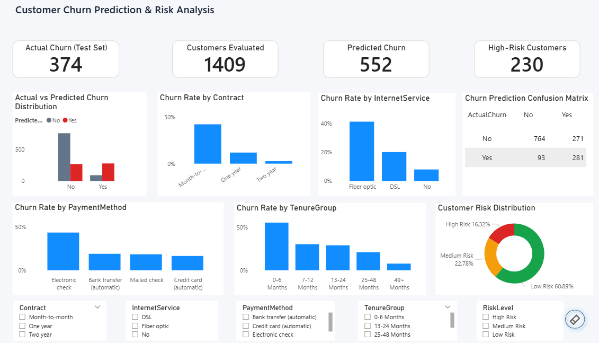
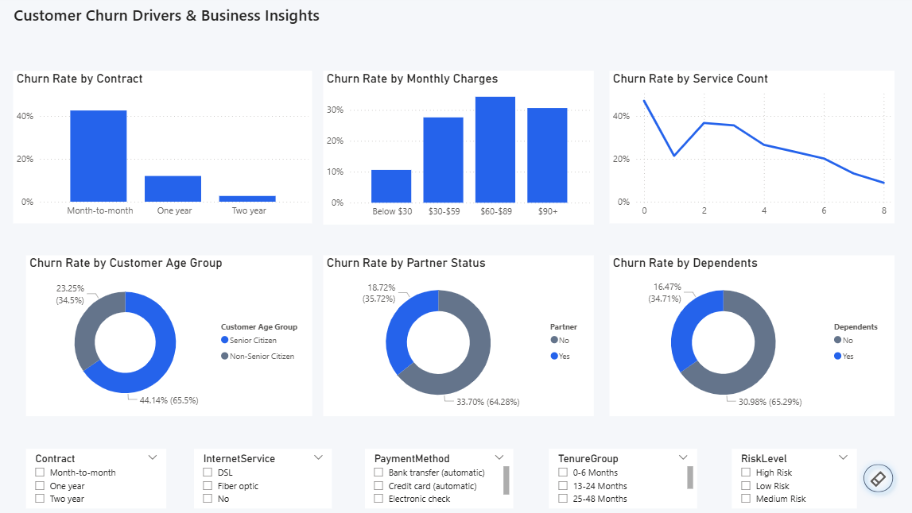
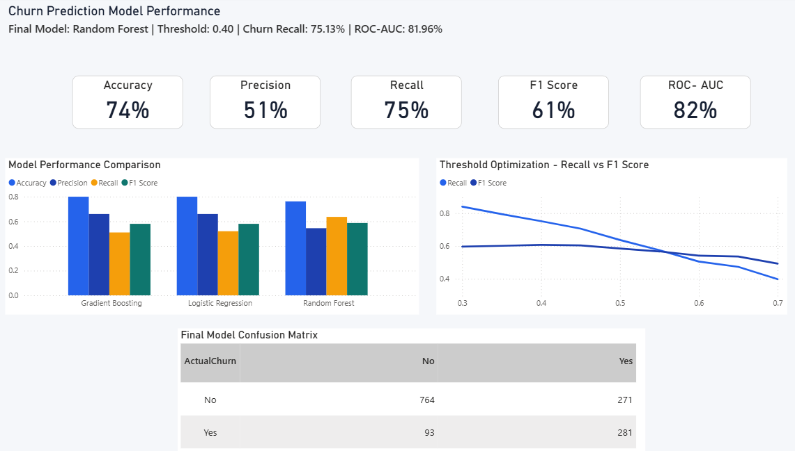

# Customer Churn Prediction & Risk Analysis

> **End-to-End Customer Churn & Retention Analytics Case Study**

An end-to-end customer churn analytics and machine learning project using **Python, SQL, Machine Learning, and Power BI** to identify customers at risk of churn and support data-driven retention decisions.

---

## 📌 Project Overview

Customer churn directly impacts revenue, customer lifetime value, and long-term business growth.

This project analyzes customer behavior and develops a machine learning solution to predict customers who are likely to churn.

The project follows an end-to-end analytics workflow covering:

- Data preprocessing
- Exploratory data analysis
- Feature engineering
- SQL-based business analysis
- Machine learning model development
- Model comparison
- Probability threshold optimization
- Customer churn prediction
- Customer risk segmentation
- Interactive Power BI reporting

The objective is to transform raw customer data into **actionable churn insights** that can help businesses identify high-risk customers and prioritize retention efforts.

---

## 🎯 Business Problem

Customer churn is a major business challenge because losing existing customers can directly impact revenue and customer lifetime value.

The key business questions addressed in this project are:

> **Which customers are most likely to churn?**

> **What customer characteristics and services are associated with higher churn?**

> **How can businesses prioritize customers for retention efforts?**

The analysis combines **descriptive analytics with predictive modeling** to answer these questions.

---

## 🎯 Key Business Objective

The primary objective is to identify customers who are likely to churn so that businesses can prioritize retention efforts.

The model emphasizes **churn recall** because failing to identify an actual churn customer can result in a missed retention opportunity.

In practical terms:

**Higher Recall → More potential churn customers identified → More opportunities for retention intervention**

---

## 📊 Dataset

The project uses the **Telco Customer Churn** dataset.

The dataset contains information related to:

- Customer demographics
- Tenure
- Contract type
- Internet services
- Payment methods
- Monthly charges
- Total charges
- Customer services
- Partner and dependent status
- Senior citizen status
- Churn status

---

## 🛠️ Tools & Technologies

| Area | Technologies |
|---|---|
| Programming | Python |
| Data Analysis | Pandas, NumPy |
| Visualization | Matplotlib |
| Machine Learning | Scikit-learn |
| Database | SQL Server |
| Business Intelligence | Power BI |
| Calculations | DAX |
| Development | Jupyter Notebook |
| Version Control | Git & GitHub |

---

# 🔄 Project Workflow

```text
Raw Customer Data
        ↓
Data Preprocessing
        ↓
Exploratory Data Analysis
        ↓
Feature Engineering
        ↓
SQL Business Analysis
        ↓
Machine Learning
        ↓
Model Comparison
        ↓
Threshold Optimization
        ↓
Churn Prediction
        ↓
Customer Risk Segmentation
        ↓
Power BI Dashboard
        ↓
Business Insights & Retention Strategy
````

---

# 🤖 Machine Learning

Three classification models were evaluated:

1. **Logistic Regression**
2. **Random Forest**
3. **Gradient Boosting**

The models were evaluated using:

* Accuracy
* Precision
* Recall
* F1 Score
* ROC-AUC

---

## 🏆 Final Model

**Random Forest** was selected as the final model.

The classification threshold was optimized from the default **0.50 to 0.40** to improve churn detection.

### Final Model Performance

| Metric    |   Score |
| --------- | ------: |
| Accuracy  | **74%** |
| Precision | **51%** |
| Recall    | **75%** |
| F1 Score  | **61%** |
| ROC-AUC   | **82%** |

### Selected Threshold

**0.40**

At this threshold:

* **Recall:** 75.13%
* **F1 Score:** 60.69%
* **ROC-AUC:** 81.96%

The selected threshold prioritizes identifying a larger proportion of actual churn customers while maintaining a reasonable balance between precision and recall.

---

# 📈 Threshold Optimization

Instead of automatically using the standard classification threshold of `0.50`, multiple thresholds were evaluated.

| Threshold |  Precision |     Recall |   F1 Score |
| --------: | ---------: | ---------: | ---------: |
|      0.30 |     46.24% |     83.96% |     59.64% |
|      0.35 |     48.37% |     79.41% |     60.12% |
|  **0.40** | **50.91%** | **75.13%** | **60.69%** |
|      0.45 |     52.80% |     70.59% |     60.41% |
|      0.50 |     54.09% |     63.64% |     58.48% |
|      0.55 |     55.99% |     57.49% |     56.73% |
|      0.60 |     58.33% |     50.53% |     54.15% |
|      0.65 |     61.89% |     47.33% |     53.64% |
|      0.70 |     64.50% |     39.84% |     49.26% |

### Why 0.40?

The threshold of **0.40** provides the highest F1 Score among the evaluated thresholds while maintaining substantially higher recall than the default 0.50 threshold.

This makes it suitable for a retention-oriented use case where missing a potential churn customer can be costly.

---

# 🔍 Model Comparison

| Model               | Accuracy | Precision | Recall | F1 Score |
| ------------------- | -------: | --------: | -----: | -------: |
| Gradient Boosting   |      80% |       66% |    51% |      58% |
| Logistic Regression |      80% |       66% |    52% |      58% |
| Random Forest       |      76% |       54% |    63% |      59% |

> The final production-oriented configuration uses **Random Forest with a 0.40 classification threshold**, resulting in the final performance metrics reported above.

---

# 📊 Power BI Dashboard

The Power BI dashboard consists of three analytical pages designed to connect customer behavior, churn risk, and machine learning performance.

---

## 1. Executive Overview

Provides a high-level business view of:

* Actual churn
* Predicted churn
* High-risk customers
* Churn rates
* Contract behavior
* Internet service behavior
* Payment method behavior
* Tenure groups
* Customer risk distribution
* Prediction confusion matrix

### Dashboard Preview



---

## 2. Customer Churn Analysis

This page focuses on identifying the major customer characteristics associated with churn.

It analyzes:

* Contract type
* Monthly charges
* Service count
* Customer age group
* Partner status
* Dependents
* Internet service
* Payment method
* Tenure

### Dashboard Preview



---

## 3. Model Performance

The model performance page provides a consolidated view of the machine learning solution.

It includes:

* Model performance comparison
* Accuracy
* Precision
* Recall
* F1 Score
* ROC-AUC
* Threshold optimization
* Final confusion matrix

### Dashboard Preview



---

# 💡 Key Business Insights

The analysis demonstrates how customer-level behavioral and service characteristics can be used to identify churn risk.

Key analytical areas include:

* Contract type and its relationship with churn
* Monthly charge levels and churn behavior
* Customer tenure and churn probability
* Internet service type and churn
* Payment method and customer retention
* Service engagement and churn risk
* Customer demographic characteristics
* Risk-based customer segmentation

These insights can support targeted retention strategies instead of applying the same retention approach to every customer.

---

# 🚨 Customer Risk Segmentation

The prediction output is further converted into customer risk levels to make the machine learning results more actionable for business teams.

Customers can be prioritized based on predicted churn probability and risk classification.

A typical retention workflow can therefore be:

```text
Predicted Churn Probability
          ↓
    Risk Segmentation
          ↓
High / Medium / Low Risk
          ↓
Retention Prioritization
          ↓
Targeted Customer Intervention
```

This bridges the gap between **machine learning predictions and business decision-making**.

---

# 🧮 SQL Analysis

SQL was used to perform customer-level and business-oriented analysis, including churn patterns across different customer attributes.

SQL analysis is available in:

```text
sql/churn-analysis.sql
```

The SQL component demonstrates the use of customer-level aggregation, filtering, grouping, churn analysis, and business-oriented queries.

---

# 📁 Project Structure

```text
customer-churn-prediction/
│
├── README.md
├── .gitignore
│
├── data/
│   ├── Telco-Customer-Churn.csv
│   ├── processed_telco_churn.csv
│   ├── model_ready_telco_churn.csv
│   ├── churn_predictions.csv
│   ├── customer_churn_model.pkl
│   └── churn_threshold.pkl
│
├── notebook/
│   ├── Data Preprocessing.py
│   ├── Feature Engineering.py
│   ├── Churn Analysis.py
│   └── Churn Model.py
│
├── sql/
│   └── churn-analysis.sql
│
└── powerbi/
    ├── customer-churn-dashboard.pbix
    └── screenshots/
        ├── executive-overview.png
        ├── customer-churn-analysis.png
        └── model-performance.png
```

---

# 📌 Key Outcome

The project demonstrates a complete **end-to-end customer churn analytics solution**, connecting:

**Data → Analysis → SQL → Machine Learning → Risk Prediction → Business Intelligence**

The final solution combines predictive modeling with interactive Power BI reporting to help businesses identify customers at risk of churn and prioritize retention efforts.

---

## 🔗 Project Components

| Component   | Purpose                                                      |
| ----------- | ------------------------------------------------------------ |
| `data/`     | Raw, processed and model-ready datasets                      |
| `notebook/` | Data preparation, analysis, feature engineering and modeling |
| `sql/`      | SQL-based churn and business analysis                        |
| `powerbi/`  | Interactive Power BI dashboard and screenshots               |
| `README.md` | Project documentation                                        |

---

## 👤 Author

**Vivekanand Shukla**

Data Analytics | SQL | Python | Machine Learning | Power BI

````
