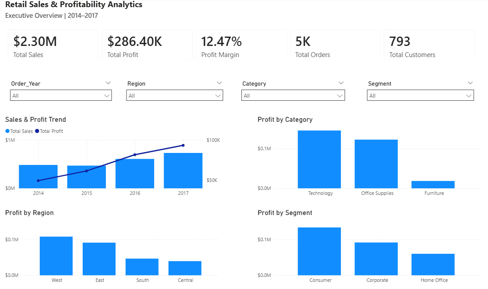
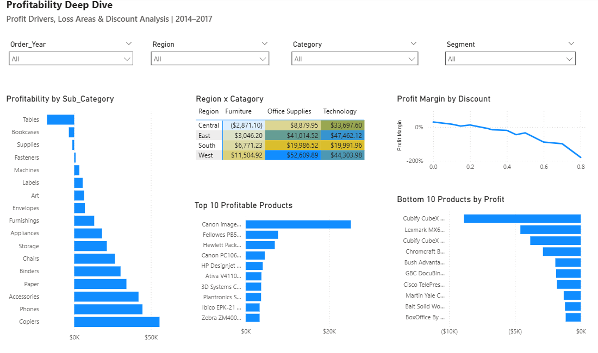

<div align="center">

# Retail Sales & Profitability Analytics

**End-to-End Data Analytics Case Study**

Python · SQL · Power BI · Excel

**9,994 Transactions** &nbsp; · &nbsp; **$2.30M Sales** &nbsp; · &nbsp; **$286.40K Profit** &nbsp; · &nbsp; **12.47% Margin**

</div>

---

## Overview

This case study analyzes retail transactions from the Sample Superstore dataset to understand **sales performance, profitability, discount behaviour, product economics, and regional performance**.

The central business question is:

> **Where is the business generating revenue, and where is that revenue failing to translate into profit?**

The analysis progresses from data validation and exploratory analysis to profitability diagnosis and business recommendations.

---

## Executive Snapshot

| Metric | Value |
|---|---:|
| Sales | **$2,297,200.86** |
| Profit | **$286,397.02** |
| Profit Margin | **12.47%** |
| Orders | **5,009** |
| Customers | **793** |
| Products | **1,862** |
| Quantity Sold | **37,873** |
| Average Order Value | **$458.61** |

---

## What the Analysis Found

### 1. Furniture is the primary category-level profitability concern

| Category | Sales | Profit | Margin |
|---|---:|---:|---:|
| Technology | $836.15K | **$145.45K** | **17.40%** |
| Office Supplies | $719.05K | **$122.49K** | **17.04%** |
| Furniture | $742.00K | **$18.45K** | **2.49%** |

Furniture generates substantial revenue, but its profit margin is significantly below the other two major categories.

The problem becomes clearer at sub-category level:

| Sub-category | Profit | Margin |
|---|---:|---:|
| **Tables** | **-$17.73K** | **-8.56%** |
| **Bookcases** | **-$3.47K** | **-3.02%** |
| Furnishings | $13.06K | 14.24% |
| Chairs | $26.59K | 8.10% |

**Tables is the largest sub-category profitability concern.**

---

### 2. Discounting is strongly associated with weaker profitability

| Discount Band | Profit Margin | Loss-making Records |
|---|---:|---:|
| **0%** | **29.51%** | **0%** |
| 1–10% | 16.61% | 4.26% |
| 11–20% | 11.58% | 13.99% |
| 21–30% | **-10.05%** | 91.63% |
| 31–40% | **-19.44%** | 88.84% |
| 41–60% | **-40.74%** | 100% |
| >60% | **-122.63%** | 100% |

The Pearson correlation between **Discount and Profit is approximately -0.220**.

> This is a descriptive association, not proof of causation. Product mix, category, region, and customer composition may also influence profitability.

---

### 3. Regional performance is uneven

| Region | Sales | Profit | Margin |
|---|---:|---:|---:|
| **West** | $725.46K | **$108.42K** | **14.94%** |
| East | $678.78K | $91.52K | 13.48% |
| South | $391.72K | $46.75K | 11.93% |
| Central | $501.24K | $39.71K | **7.92%** |

The weakest Region × Category combination is **Central × Furniture**:

**~$163.80K Sales → ~-$2.87K Profit → ~-1.75% Margin**

---

### 4. Revenue growth should be evaluated with profitability

Sales increased from approximately **$484K in 2014** to **$733K in 2017**.

However, sales and profit did not move proportionally in every year.

In **2015**, sales decreased by approximately **2.83%**, while profit increased by approximately **24.37%**.

This demonstrates why revenue growth alone is not sufficient to evaluate business performance.

---

## Business Questions

The analysis was designed around six practical questions:

1. Is sales growth translating into profit growth?
2. Which categories and sub-categories create the most value?
3. Which products generate losses?
4. How does discounting relate to profitability?
5. Which regions and customer segments perform best?
6. Where are profitability problems concentrated?

---

## Analytical Workflow

```text
Raw Data
   ↓
Data Quality Audit
   ↓
Cleaning & Preparation
   ↓
Exploratory Analysis
   ↓
KPI & Time Analysis
   ↓
Product & Category Analysis
   ↓
Discount Analysis
   ↓
Regional & Customer Analysis
   ↓
Business Diagnosis
   ↓
Recommendations
````

---

## Data Quality

| Check                    |    Result |
| ------------------------ | --------: |
| Records                  |     9,994 |
| Columns                  |        21 |
| Duplicate Rows           |     **0** |
| Missing Values           |     **0** |
| Invalid Dates            |     **0** |
| Ship Before Order        |     **0** |
| Negative / Zero Sales    |     **0** |
| Negative / Zero Quantity |     **0** |
| Negative-profit Records  | **1,871** |

Negative-profit records were intentionally retained because they are necessary for understanding the actual profitability picture.

---

## Business Recommendations

### 01 — Discount Governance

Review high-discount transactions and evaluate category-specific discount thresholds.

### 02 — Furniture Profitability

Investigate Tables and Bookcases at product, discount, and regional level before making pricing or assortment decisions.

### 03 — Regional Strategy

Investigate Central × Furniture separately rather than treating the entire Central region as underperforming.

### 04 — Executive KPI Reporting

Track **Sales, Profit, and Profit Margin together**.

### 05 — Product Concentration

Monitor dependence on high-profit products and identify opportunities to broaden the profit base.

---

## Technical Stack

| Area                  | Tools                                                                          |
| --------------------- | ------------------------------------------------------------------------------ |
| Programming           | Python                                                                         |
| Data Analysis         | Pandas, NumPy                                                                  |
| Querying              | SQL                                                                            |
| Business Intelligence | Power BI, DAX                                                                  |
| Spreadsheet Analysis  | Microsoft Excel                                                                |
| Methods               | Data Cleaning, EDA, KPI Analysis, Time-Series Analysis, Profitability Analysis |

---

# Power BI Dashboard

The project includes an interactive Power BI dashboard designed to monitor overall business performance and investigate the key drivers of profitability.

### Executive Overview

The Executive Overview provides a high-level view of business performance across:

* Sales and profit
* Profit margin
* Order and customer volume
* Yearly sales and profit trends
* Category profitability
* Regional profitability
* Customer segment performance



### Profitability Deep Dive

The Profitability Deep Dive focuses on identifying profit drivers, loss-making areas, discount-related profitability patterns, regional-category performance, and product-level profitability.



### Dashboard Capabilities

* Interactive filtering by year, region, category, and customer segment
* Executive KPI monitoring
* Sales and profit trend analysis
* Category and regional profitability analysis
* Sub-category profitability analysis
* Discount versus profit-margin analysis
* Region × category profitability diagnostics
* Top and bottom product profitability analysis

---

# Repository Structure

```text
retail-sales-profitability/
│
├── README.md
│
├── data/
│   ├── superstore_raw.csv
│   └── superstore_cleaned.csv
│
├── scripts/
│   ├── data_audit.py
│   └── exploratory_data_analysis.py
│
├── sql/
│   └── business_questions.sql
│
└── powerbi/
    ├── retail_sales_profitability.pbix
    ├── executive-overview.png
    └── profitability-deep-dive.png
```

---

## Project Status

| Component                        |  Status  |
| -------------------------------- | :------: |
| Data Quality Audit               | Complete |
| Data Cleaning                    | Complete |
| KPI Analysis                     | Complete |
| Time Trend Analysis              | Complete |
| Category & Sub-category Analysis | Complete |
| Product Profitability            | Complete |
| Discount Analysis                | Complete |
| Regional Analysis                | Complete |
| Customer Analysis                | Complete |
| Business Diagnosis               | Complete |
| SQL Analysis Layer               | Complete |
| Power BI Dashboard               | Complete |
| Predictive Modelling             |  Future  |

---

## What This Project Demonstrates

This case study demonstrates the complete analytical chain:

**Business Question → Data Validation → Analysis → Evidence → Insight → Recommendation**

The emphasis is on understanding **what changed, where profitability is being created or lost, and which business areas deserve further investigation**.

---

## Future Enhancements

* Advanced SQL analysis and window functions
* Statistical testing of discount-profit relationships
* Customer segmentation
* Predictive profitability modelling
* Automated reporting

---

## Project Context

**Type:** Independent Portfolio Project
**Domain:** Retail Analytics
**Dataset:** Sample Superstore
**Analysis Period:** 2014–2017

This is an independent portfolio case study created to demonstrate practical data analytics skills. The dataset is a public/sample dataset and does not represent employer or client work.
